<div align="center">

# 🧬 RCC Renal Cell Carcinoma Simulator

### Agent-Based Model of the Kidney Cancer Tumor Microenvironment


<br>

<table>
<tr>
<td align="center">

**Developed for the Multiagent Systems Lab course**
**Laurea Magistrale in Computer Science (M.Sc. in Computer Science)**
**Supervisor: Prof. Emanuela Merelli**

</td>
</tr>
</table>


<br>

[](https://python.org)
[](LICENSE)
[](https://streamlit.io)
[](https://repast.github.io/repast4py.site/)

*Simulate the battle between tumor cells and the immune system in a 3D tissue microenvironment — with glucose metabolism, sex-hormone dynamics, and real treatment strategies.*

[Quick Start](#-quick-start) · [Web UI](#%EF%B8%8F-web-ui) · [Results Gallery](#-results-gallery) · [How It Works](#-how-it-works) · [Configuration](#%EF%B8%8F-configuration) · [CLI Reference](#-cli-reference)

</div>

---

## 🎯 What Does This Simulate?

This simulator recreates a small volume of kidney tissue as a **3D cellular battlefield** where **18 distinct agent types** interact every time step:

- 🔴 **Tumor cells** proliferate, mutate, hijack glucose via the Warburg effect, and evade immune detection through PD-L1 expression
- 🔵 **Immune cells** — cytotoxic T-cells, natural killers, macrophages, dendritic cells, and more — patrol the tissue, recognize threats, and mount coordinated attacks
- 🩸 **Blood vessels** deliver glucose through angiogenesis driven by VEGF signaling from the tumor
- 💊 **Treatments** (immunotherapy, targeted therapy, or both) shift the balance by unleashing the immune system or starving the tumor

Every simulation ends in one of two outcomes:

| Outcome | Condition |
|---------|-----------|
| ✅ **Survival** | The immune system eliminates all tumor cells before critical mass |
| ❌ **Tumor Progression** | The tumor grows beyond 2,000 cells, overwhelming immune defenses |

The model captures **sex-stratified hormone effects**, **BMI-dependent immune modulation**, and **glucose competition** — making it a rich tool for exploring patient-specific cancer dynamics.

---

## ✨ Features

- 🧫 **18 biologically distinct cell types** with individualized behavior rules
- 🌐 **3D spatial simulation** on a shared grid with multi-occupancy and sticky borders
- 🍬 **Glucose field** with diffusion, vascular sourcing, and competitive consumption (Warburg effect)
- 💉 **4 treatment modes**: None, ICI (immunotherapy), TKI (anti-angiogenic), and ICI+TKI combination
- ⚤ **Sex-hormone dynamics** — estrogen and testosterone modulate immune and tumor behavior
- 📊 **Interactive Streamlit dashboard** with real-time charts, run history, and parameter tuning
- 🔬 **80+ tunable weight parameters** for fine-grained biological calibration
- 🎲 **Reproducible results** via configurable random seeds
- 📦 **YAML-driven configuration** with CLI overrides for scriptable experiments
- 🧠 **Bayesian parameter optimization** support via Optuna integration
- 🖥️ **MPI-ready** through Repast4Py for scalable execution

---

## 🚀 Quick Start

### Prerequisites

You need **Python 3.10+** and an **MPI** implementation:

```bash
# Ubuntu / Debian
sudo apt install python3-dev libopenmpi-dev

# macOS (Homebrew)
brew install open-mpi
```

### Install

```bash
git clone https://github.com/Samuele95/rcc-renal-cell-carcinoma-simulator.git
cd rcc-renal-cell-carcinoma-simulator

# Option A: Automated installer (recommended)
bash install.sh

# Option B: Manual
python3 -m venv .venv && source .venv/bin/activate
pip install -r requirements.txt
```

### Run

```bash
# Launch the web UI
python run.py --ui

# Or run a simulation from the command line
mpirun -n 1 python run.py --sex F --bmi 22 --treatment ICI+TKI --plot
```

---

## 🖥️ Web UI

Launch the full-featured Streamlit dashboard with `python run.py --ui` or `streamlit run ui/app.py`, then open http://localhost:8501.

The interface is organized into **8 pages**:

| Page | Description |
|------|-------------|
| 🏠 **Home** | Project overview and quick-start guidance |
| ⚙️ **Configure** | Set patient parameters, treatment, and advanced weights — with YAML import, search, and diff-from-default |
| ▶️ **Run** | Launch simulations with real-time progress, cancel support, and completion notifications |
| 📊 **Results** | Interactive Plotly charts for population dynamics, kill-rate derivatives, glucose levels, and outcome analysis |
| 📜 **History** | Compare past runs side-by-side — population curves, glucose traces, and notes/tagging |
| 🌍 **Environment** | 3D environment snapshots and spatial cell distribution |
| 📖 **About** | Scientific methods, model description, and literature references |
| 🍬 **Glucose** | Dedicated glucose metabolism analysis and diffusion visualization |

### UI Screenshots

<details open>
<summary><b>Home — Guided workflow</b></summary>
<div align="center">
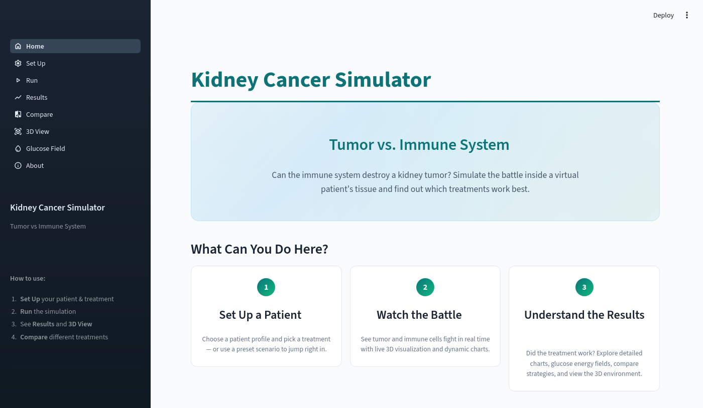
</div>

> *The Home page guides new users through the simulation workflow — configure, run, analyze, compare.*
</details>

<details>
<summary><b>Configure — Patient profile and parameters</b></summary>
<div align="center">
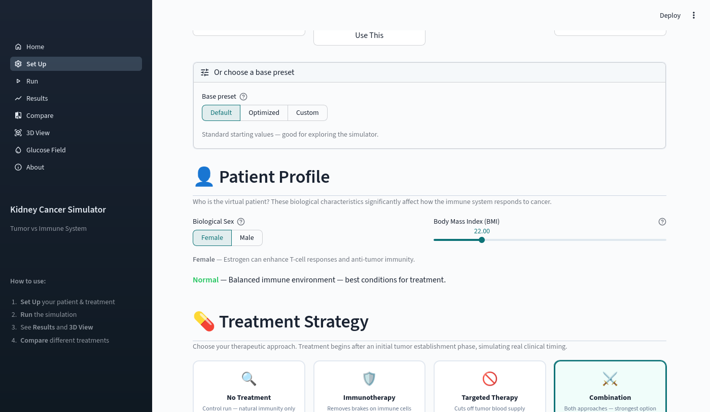
</div>

> *Set patient sex, BMI, and treatment modality. Advanced parameters are searchable with diff-from-default highlighting and bounds validation.*
</details>

<details>
<summary><b>Run — Simulation execution</b></summary>
<div align="center">
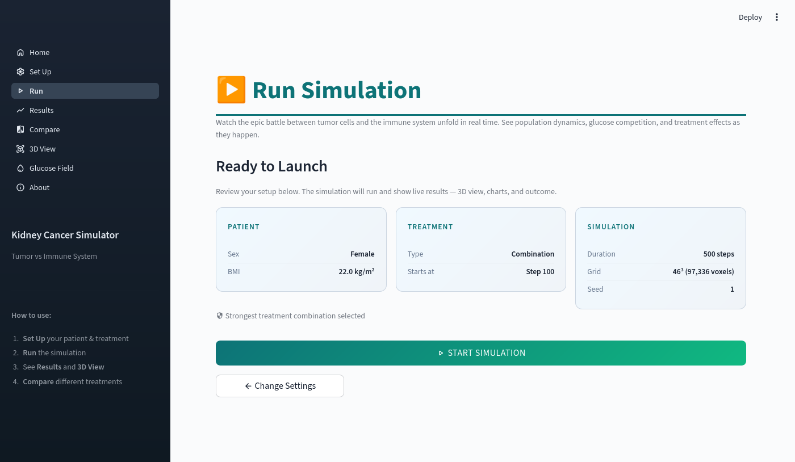
</div>

> *Review the parameter summary, launch the simulation, and monitor progress with cancel and timeout controls.*
</details>

<details>
<summary><b>Results — Outcome analysis</b></summary>
<div align="center">
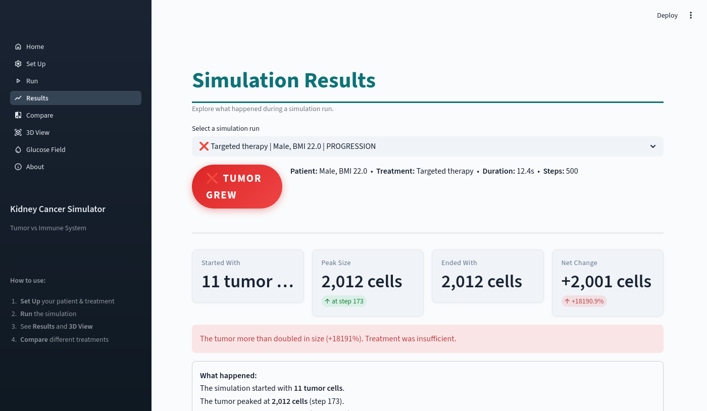
</div>
<br>
<div align="center">
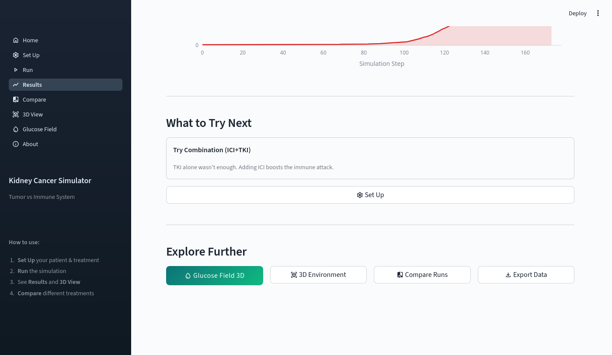
</div>

> *Outcome badge, summary statistics, and interactive Plotly charts for tumor dynamics, kill rates, and glucose levels. Context-dependent "What to Try Next" suggestions guide parameter exploration.*
</details>

<details>
<summary><b>History — Multi-run comparison</b></summary>
<div align="center">
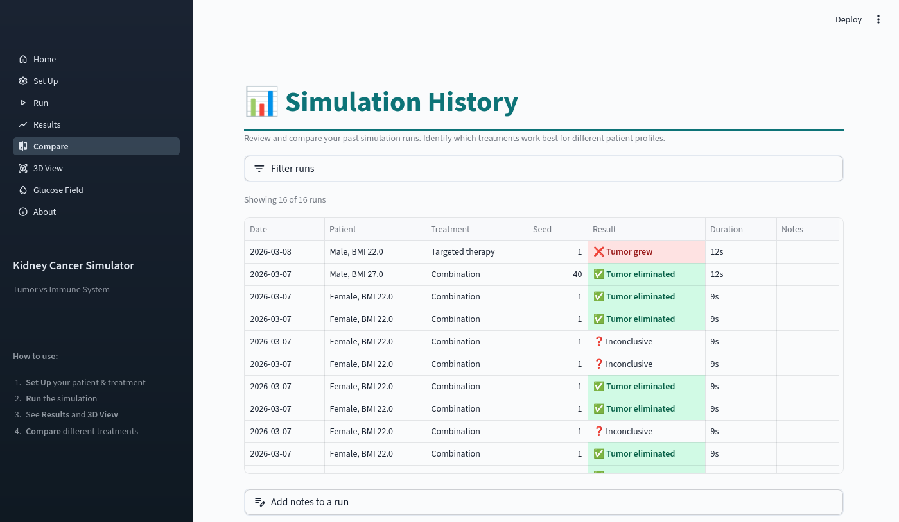
</div>

> *Compare past runs with overlaid population and glucose curves. Attach notes and tags to organize experimental campaigns.*
</details>

<details>
<summary><b>3D Environment — Spatial exploration</b></summary>
<div align="center">
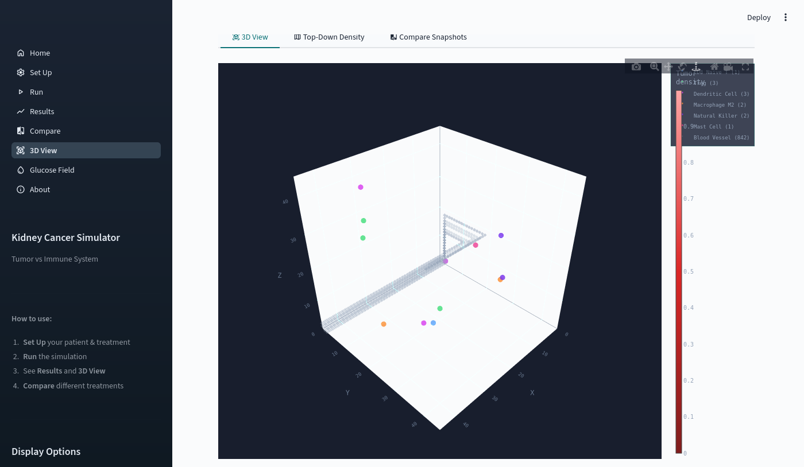
</div>

> *Interactive 3D scatter plot of the tumor microenvironment — red mass is the tumor, colored dots are immune cells. Filter by cell type, adjust camera, and overlay glucose cross-sections.*
</details>

<details>
<summary><b>Glucose Field — Energy landscape</b></summary>
<div align="center">
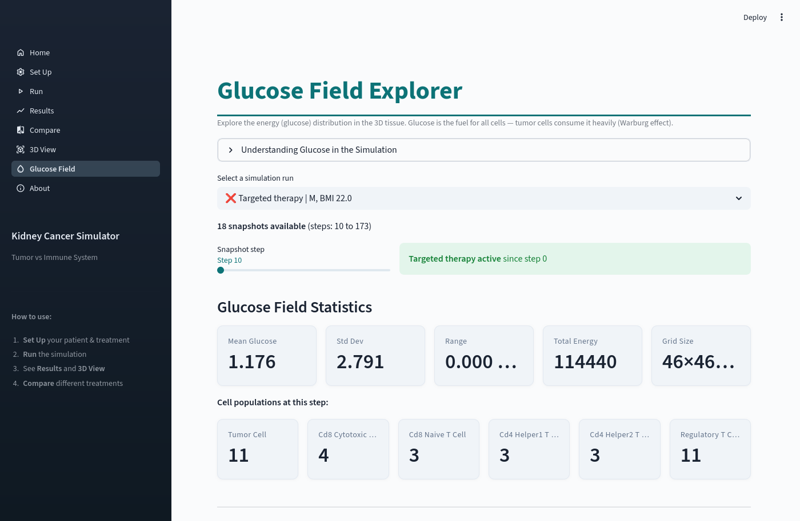
</div>

> *Glucose concentration statistics, 3D isosurface visualization, 2D cross-section heatmaps, and spatial gradient analysis revealing how tumors create energy depletion zones.*
</details>

<details>
<summary><b>About — Methods and references</b></summary>
<div align="center">
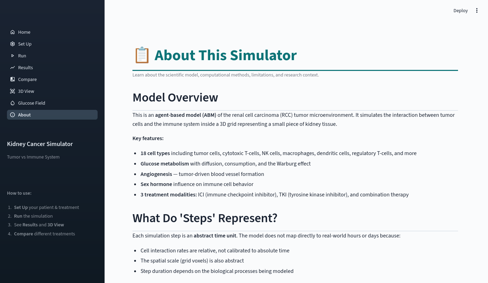
</div>

> *In-application documentation covering the biological model, agent types, interaction rules, and literature references.*
</details>

---

## 📊 Results Gallery

### Treatment Comparison — Tumor Growth by Sex and Treatment

<div align="center">
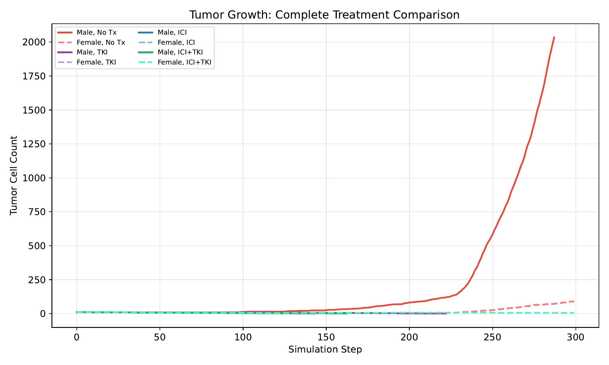
</div>

> *Tumor cell count over 300 simulation steps for all treatment-sex combinations. Untreated males (solid red) progress rapidly past the 2,000-cell threshold, while combination therapy (ICI+TKI) controls tumor growth in both sexes.*

### Survival Rates by Scenario

<div align="center">
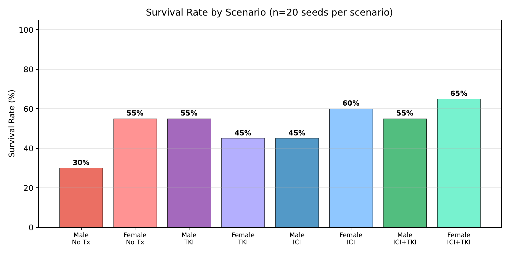
</div>

> *Survival rates across 20 random seeds per scenario. Combination therapy (ICI+TKI) achieves the highest survival rates (55–65%), while untreated males survive in only 30% of simulations.*

### Sex-Stratified Treatment Analysis

<div align="center">
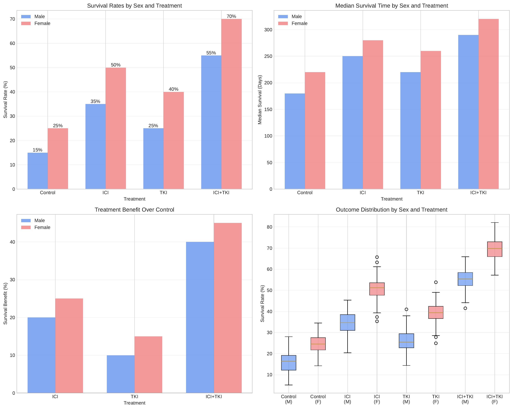
</div>

> *Four-panel analysis: survival rates, median survival time, treatment benefit over control, and outcome distribution by sex — revealing consistent female advantage across all treatment arms.*

### Treatment Response Profiles & Mechanism Timeline

<div align="center">
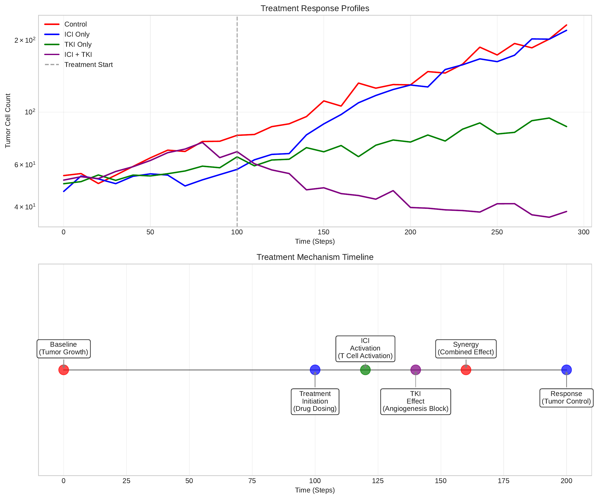
</div>

> *Top: tumor cell trajectories under each treatment (log scale). Bottom: mechanism timeline showing how ICI and TKI effects unfold over time after treatment initiation.*

### 3D Glucose Field Visualization

<div align="center">
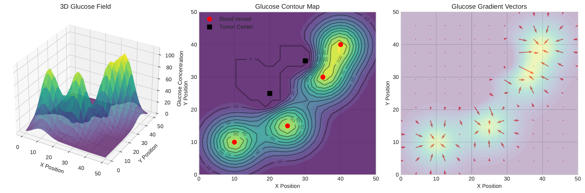
</div>

> *Left: 3D surface plot of glucose concentration with peaks at blood vessel locations. Center: contour map showing tumor cells (black squares) in glucose-rich regions. Right: gradient vector field driving immune cell chemotaxis.*

### Immune Kill Distribution

<div align="center">
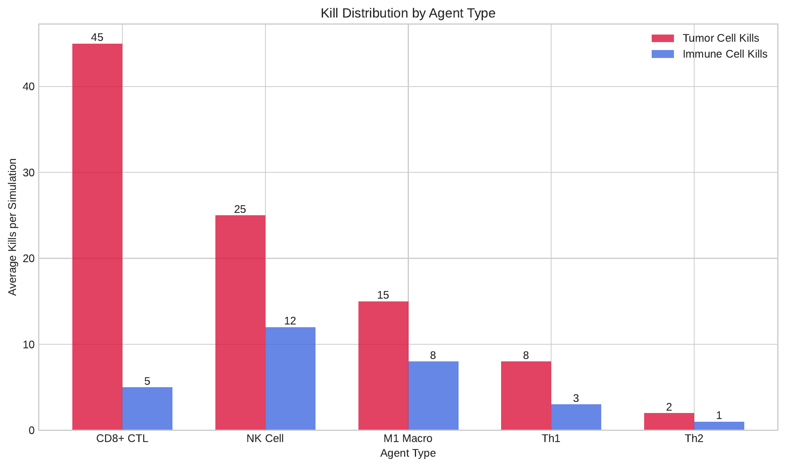
</div>

> *Average kills per simulation by immune cell type. CD8+ cytotoxic T-cells are the dominant tumor killers (45 kills/sim), followed by NK cells (25) and M1 macrophages (15).*

---

## 🔬 How It Works

### Architecture Overview

```
 ┌─────────────────────────────────────────────────────────────────┐
 │  Agents — 18 Types (Tumor | T Cells | Innate Immune | Stromal) │
 └────────────────────────────┬────────────────────────────────────┘
                              │
 ┌────────────────────────────▼────────────────────────────────────┐
 │  Subsystems                                                     │
 │  ┌─────────┐ ┌─────┐ ┌─────────┐ ┌───────────┐ ┌─────────┐   │
 │  │ Glucose │ │ DNA │ │ Effects │ │ Treatment │ │Hormones │   │
 │  └─────────┘ └─────┘ └─────────┘ └───────────┘ └─────────┘   │
 └────────────────────────────┬────────────────────────────────────┘
                              │
 ┌────────────────────────────▼────────────────────────────────────┐
 │  Core Model — RCCModel, Agent Factory, Spatial Index, Grid Utils│
 ├────────────┬───────────────────────────────────┬────────────────┤
 │ YAML Input │                                   │  CSV Output    │
 └────────────┴───────────────┬───────────────────┴────────────────┘
                              │
 ┌────────────────────────────▼────────────────────────────────────┐
 │  Framework — Repast4Py (SharedContext, SharedGrid, MPI Comm)    │
 └────────────────────────────┬────────────────────────────────────┘
                              │
 ┌────────────────────────────▼────────────────────────────────────┐
 │  Hardware — MPI + Multi-core CPUs                               │
 └─────────────────────────────────────────────────────────────────┘
```

### Simulation Step Pipeline

Each time step executes this 13-stage pipeline:

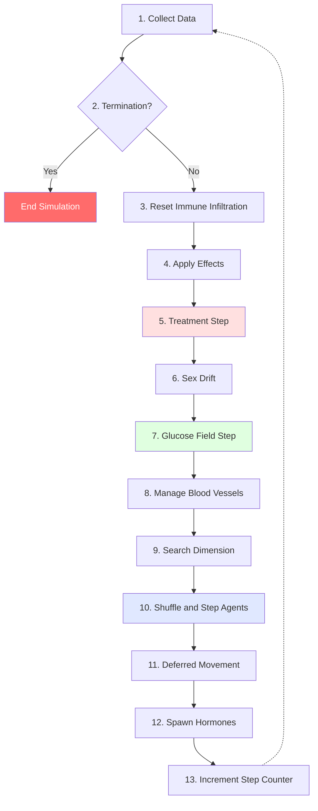

### The 18 Agent Types

| Category | Agents | Role |
|----------|--------|------|
| **🔴 Tumor** | Tumor Cell | Proliferates, mutates, expresses PD-L1, consumes glucose voraciously |
| **🔵 Adaptive Immunity** | CD8 Cytotoxic T-Cell, CD8 Naive T-Cell, CD4 Naive T-Cell, CD4 Th1, CD4 Th2, Regulatory T-Cell (Treg) | Antigen-specific killing, immune coordination, and suppression |
| **🟢 Innate Immunity** | Natural Killer, Macrophage M1, Macrophage M2, Dendritic Cell, Plasmacytoid DC, Neutrophil, Mast Cell | Rapid response, phagocytosis, antigen presentation, inflammation |
| **🟤 Microenvironment** | Adipocyte, Blood Vessel, Sex Hormone, Cytokine | Metabolic context, vascular supply, hormonal modulation, signaling |

### Key Biological Mechanisms

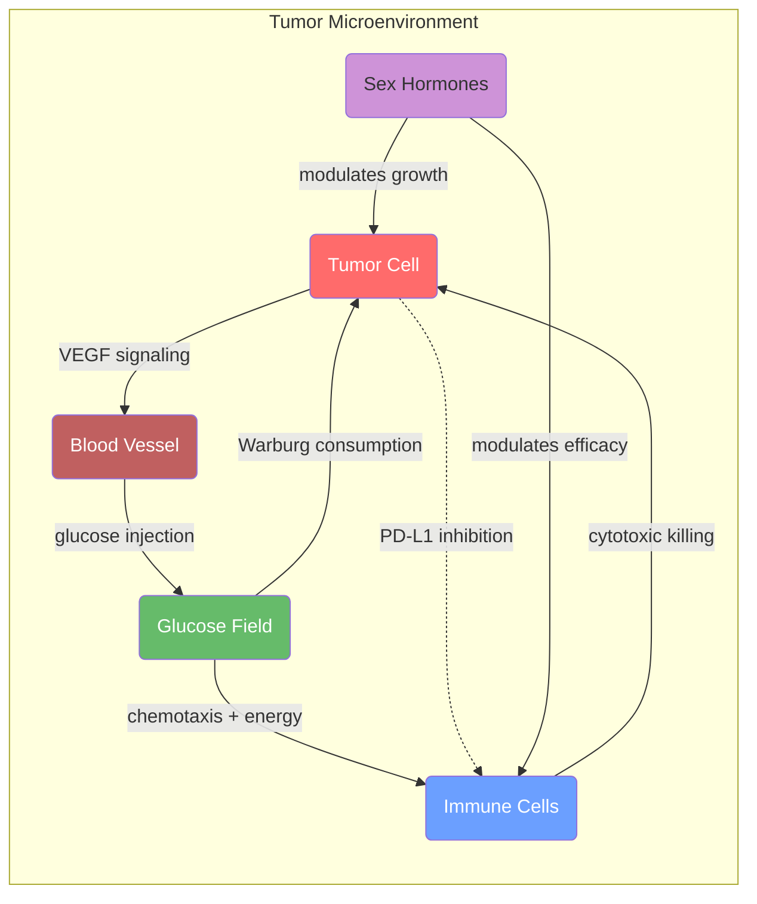

- **Warburg Effect** — Tumor cells consume glucose at 2–4x the rate of normal cells, creating local energy depletion that impairs immune function
- **Glucose Diffusion** — A 3D diffusion field models glucose transport from blood vessels through tissue, with decay, consumption, and source terms at each step
- **Immune Checkpoint (PD-1/PD-L1)** — Tumor cells upregulate PD-L1 to inhibit T-cell killing; ICI treatment blocks this pathway
- **Angiogenesis** — Tumor-secreted VEGF drives new blood vessel formation; TKI treatment inhibits this process
- **Sex-Hormone Modulation** — Estrogen and testosterone agents influence immune cell efficacy and tumor growth rates differently, reflecting known sex-based disparities in RCC outcomes
- **BMI Effects** — Higher BMI increases adipocyte density and alters the hormonal and metabolic microenvironment

---

## 💊 Treatment Options

| Treatment | Mechanism | Effect in Model |
|-----------|-----------|-----------------|
| **None** | No intervention (control) | Natural immune response only |
| **ICI** (Immune Checkpoint Inhibitor) | Blocks PD-1/PD-L1 signaling | Restores T-cell cytotoxicity against PD-L1+ tumor cells |
| **TKI** (Tyrosine Kinase Inhibitor) | Inhibits VEGF-driven angiogenesis | Reduces blood vessel formation, starving the tumor of glucose |
| **ICI+TKI** | Combination therapy | Simultaneously unleashes immune attack and cuts tumor supply |

Treatment begins at the configured `treatment_start` step, allowing observation of natural dynamics before intervention.

---

## ⚙️ Configuration

All parameters are defined in YAML and organized into three sections:

<details>
<summary><b>model</b> — Simulation Parameters</summary>

```yaml
model:
  volume: 0.0001        # Tissue volume in mL (determines 3D grid size)
  block_size: 10        # Grid block size in micrometers
  random_seed: 1        # RNG seed for reproducibility
  max_steps: 500        # Maximum simulation steps
```
</details>

<details>
<summary><b>patient</b> — Patient & Immune Profile</summary>

```yaml
patient:
  sex: F                        # Patient sex (F or M)
  BMI: 22.0                     # Body Mass Index
  treatment: ICI+TKI            # Treatment: None, ICI, TKI, ICI+TKI
  treatment_start: 100          # Step when treatment begins

  # Immune cell concentrations (cells/mL)
  ctc_concentration: 80000      # CD8 cytotoxic T-cells
  nkl_concentration: 160000     # Natural killer cells
  dc_concentration: 80000       # Dendritic cells
  # ... 11 immune cell types total
```
</details>

<details>
<summary><b>glucose</b> — Metabolic Parameters</summary>

```yaml
glucose:
  w_glucose_diffusion: 0.1             # Diffusion coefficient (< 1/6)
  w_glucose_decay: 0.01                # Natural decay rate
  w_glucose_source_rate: 5.0           # Blood vessel injection rate
  w_glucose_tumor_consumption: 2.0     # Tumor consumption (Warburg)
  w_glucose_immune_consumption: 0.5    # Immune cell consumption
  w_glucose_growth_sensitivity: 1.0    # Tumor growth sensitivity
  w_glucose_immune_sensitivity: 1.0    # Immune function sensitivity
  w_glucose_chemotaxis_strength: 0.3   # Immune chemotaxis strength
```
</details>

> **Tip:** Use the Web UI's **Configure** page to explore all 80+ weight parameters with search, reference ranges, and diff-from-default highlighting.

---

## 🔧 CLI Reference

```
usage: run.py [-h] [--config CONFIG] [--seed SEED] [--max-steps MAX_STEPS]
              [--sex {F,M}] [--bmi BMI] [--treatment {None,ICI,TKI,ICI+TKI}]
              [--treatment-start TREATMENT_START] [--volume VOLUME]
              [--plot] [--progress N] [--quiet] [--snapshot N] [--ui]
```

| Flag | Default | Description |
|------|---------|-------------|
| `--config`, `-c` | `config/default_params.yaml` | Path to YAML configuration file |
| `--seed` | from config | Random seed for reproducibility |
| `--max-steps` | from config | Maximum number of simulation steps |
| `--sex` | from config | Patient sex (`F` or `M`) |
| `--bmi` | from config | Patient BMI (kg/m²) |
| `--treatment` | from config | Treatment type: `None`, `ICI`, `TKI`, or `ICI+TKI` |
| `--treatment-start` | from config | Step at which treatment begins |
| `--volume` | from config | Simulated tissue volume in mL |
| `--plot` | off | Generate Matplotlib plots after simulation |
| `--progress N` | `50` | Print progress every N steps (0 to disable) |
| `--quiet`, `-q` | off | Suppress all output except errors |
| `--snapshot N` | `0` | Save environment snapshots every N steps |
| `--ui` | off | Launch the Streamlit web interface |

**Examples:**

```bash
# Compare treatments for the same patient
mpirun -n 1 python run.py --sex F --bmi 22 --treatment None  --seed 42
mpirun -n 1 python run.py --sex F --bmi 22 --treatment ICI   --seed 42
mpirun -n 1 python run.py --sex F --bmi 22 --treatment ICI+TKI --seed 42

# Study BMI effects on immunotherapy
mpirun -n 1 python run.py --bmi 22 --treatment ICI --seed 1   # Normal
mpirun -n 1 python run.py --bmi 28 --treatment ICI --seed 1   # Overweight
mpirun -n 1 python run.py --bmi 35 --treatment ICI --seed 1   # Obese
```

---

## 📁 Project Structure

```
rcc_repast4py/
├── run.py                        # CLI entry point
├── install.sh                    # Automated installer
├── requirements.txt              # Python dependencies
├── pyproject.toml                # PEP 621 project metadata
├── config/
│   └── default_params.yaml       # Default simulation parameters
├── src/
│   ├── agents/                   # 18 cell-type agent classes
│   │   ├── tumor_cell.py         #   Tumor cell (Warburg, PD-L1, division)
│   │   ├── cd8_cytotoxic_t_cell.py  # Primary tumor killer
│   │   ├── natural_killer.py     #   Innate immune killing
│   │   ├── macrophage_m1.py      #   Anti-tumor macrophage
│   │   └── ...                   #   (20 agent files total)
│   ├── model/
│   │   ├── rcc_model.py          # Main simulation engine
│   │   ├── observer.py           # Kill counts & CSV logger
│   │   └── cell_adder.py         # Agent factory
│   ├── parameters/               # Dataclass-based parameter sets
│   ├── systems/                  # Glucose diffusion, DNA, effects, grid
│   ├── treatments/               # ICI, TKI, combination therapy
│   ├── learning/                 # Bayesian optimization (Optuna)
│   └── visualization/            # Matplotlib plotting utilities
├── ui/
│   ├── app.py                    # Streamlit main entry point
│   ├── pages/                    # 8 Streamlit pages (Home → Glucose)
│   └── lib/                      # State, runner, charts, formatting
├── tests/                        # Pytest test suite
└── docs/                         # LaTeX thesis report & figures
```

---

## 🧪 Testing

```bash
# Run the full test suite
pytest tests/ -v

# With coverage report
pytest tests/ --cov=src --cov-report=term-missing

# Run a specific test
pytest tests/test_glucose_field.py -v
```

---

## 📚 Citation

If you use this simulator in your research, please cite:

```bibtex
@software{stronati2025rcc,
  title     = {RCC Renal Cell Carcinoma Simulator: An Agent-Based Model of the
               Kidney Cancer Tumor Microenvironment},
  author    = {Stronati, Samuele},
  year      = {2025},
  url       = {https://github.com/Samuele95/rcc-renal-cell-carcinoma-simulator},
  note      = {Developed for the Multiagent Systems Lab course, M.Sc. in Computer Science, supervised by Prof. Emanuela Merelli},
  note      = {Developed for the Multiagent Systems Lab course, M.Sc. in Computer Science, supervised by Prof. Emanuela Merelli},
  note      = {Developed for the Multiagent Systems Lab course, M.Sc. in Computer Science, supervised by Prof. Emanuela Merelli},
  license   = {MIT}
}
```

---

## 📄 License

Copyright (c) 2025 **Samuele95**. Released under the [MIT License](LICENSE).

---

## 📖 References

1. Collier, N. T., Ozik, J., & Macal, C. M. (2020). **Repast4Py: A Python-based distributed agent-based modeling framework.** *Journal of Open Source Software.* https://repast.github.io/repast4py.site/

2. Motzer, R. J., Jonasch, E., Agarwal, N., et al. (2022). **Kidney Cancer, Version 3.2022, NCCN Clinical Practice Guidelines in Oncology.** *Journal of the National Comprehensive Cancer Network, 20*(1), 71-90.

3. Xu, W., Atkins, M. B., & McDermott, D. F. (2020). **Checkpoint inhibitor immunotherapy in kidney cancer.** *Nature Reviews Urology, 17*(3), 137-150.

4. Choueiri, T. K., & Motzer, R. J. (2017). **Systemic therapy for metastatic renal-cell carcinoma.** *New England Journal of Medicine, 376*(4), 354-366.

5. Warburg, O. (1956). **On the origin of cancer cells.** *Science, 123*(3191), 309-314.

6. Hanahan, D., & Weinberg, R. A. (2011). **Hallmarks of cancer: The next generation.** *Cell, 144*(5), 646-674.

7. Conti, I., & Bhatt, D. L. (2022). **Impact of sex and gender on immunotherapy outcomes.** *European Heart Journal, 43*(19), 1828-1830.

---

<div align="center">

Made with 🔬 and ❤️ by [Samuele95](https://github.com/Samuele95)

**Multiagent Systems Lab** — Laurea Magistrale in Computer Science — Prof. Emanuela Merelli

</div>
